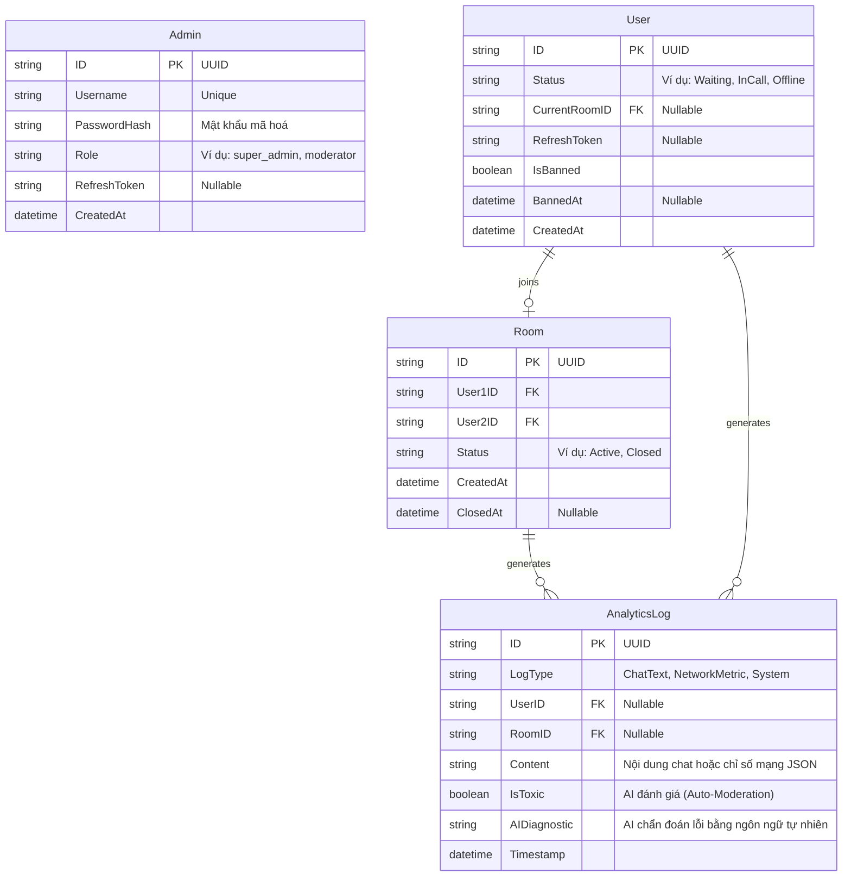

# Entity Relationship Diagram (ERD)

Dưới đây là sơ đồ thực thể mối quan hệ cho hệ thống Adaptive StrangerChat:

## Các thực thể chính:
1. **Admin**: Đại diện cho quản trị viên đăng nhập vào Dashboard (gắn với `svc-admin`). Có Username/Password riêng biệt với người dùng ẩn danh.
2. **User**: Đại diện cho client đang kết nối ẩn danh (gắn với `svc-chat`). Lưu trạng thái để ghép cặp và chống spam/ban.
3. **Room**: Phòng chat P2P sinh ra khi Matchmaking thành công giữa 2 User.
4. **AnalyticsLog**: Nguồn dữ liệu log stream bất đồng bộ sinh ra từ chat và network. AI sẽ dựa vào đây để đánh dấu `IsToxic` (kích hoạt kick/ban) hoặc phân tích `AIDiagnostic` (Root Cause Analysis).
